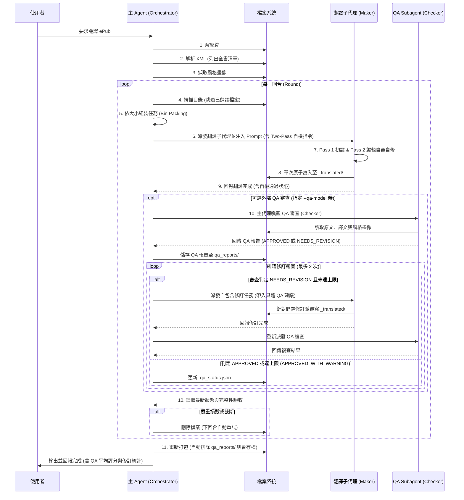

# Awesome ePub Translator: 技術實作解析

這份文件深入解析 `awesome-epub-translator` 技能在 OpenCode 多代理人架構下的技術實作細節。這個技能展示了如何利用大語言模型 (LLM) 結合多代理 (Multi-Agent) 架構，完成複雜的檔案處理與長文本翻譯任務。

## 1. 系統架構與設計哲學

此技能的核心設計哲學是 **「以自然語言定義程式邏輯」與「語意解析優先」**。整個翻譯的 Workflow 是寫在 `SKILL.md` 中的 Markdown 指令。主 Agent 扮演 Orchestrator（協調者）的角色，負責檔案系統操作、解析 XML 結構、策略分配，並調度 Subagents（子代理）來處理耗時的翻譯工作。

### 為什麼選擇 Agentic 解析（而非傳統程式解析）？

在開發文件翻譯工具時，業界最傳統的作法是「程式解析 (Programmatic Parsing) + API 呼叫」——亦即利用 BeautifulSoup 等腳本把純文字節點抽出，送交翻譯後再塞回原節點。然而，本專案刻意捨棄此作法，改讓 Agent 直接處理帶有 HTML 標籤的原始碼，主要原因在於解決**「語意斷層」與「行內標籤 (Inline Tags)」**的痛點：

* **從「語法解析」走向「語意解析」**：傳統程式只能依據 HTML 標籤（如 `<p>`, `<span>`, `<br/>`）生硬地切斷句子。由於電子書製作者經常為了視覺排版（如首字放大、句中變色、強制換行）在句中插入標籤，這會導致完整的語意被切碎。透過 Agentic 解析，我們將「斷句與分塊」的責任交給 LLM。Agent 一次讀取大段 HTML，能跨越視覺標籤的干擾，還原並翻譯完整的語意。
* **行內標籤的語序重組**：不同語言的文法語序不同。例如 `<p>This is a <em>very important</em> concept in <strong>Python</strong>.</p>` 翻譯成中文時，由於語序改變，標籤的位置必須對應移動。傳統程式無法判斷 `<em>` 該套在中文的哪個詞彙上。而 Agent 能在翻譯時，自然地將 HTML 標籤精準地重組並包覆在目標語言正確的詞彙上，保留最完美的排版。

### 系統架構圖 (Architecture)
此架構展示了主代理（Orchestrator）、子代理群與檔案系統之間的星狀拓樸關係（Star / Hub-and-Spoke Pattern）。此設計採用 OpenCode 扁平調度模式，由主代理人直接掌控調度與審查。

```mermaid
graph TD
    User([使用者]) -->|"啟動指令"| MainAgent["主 Agent（星狀協調者）"]
    
    subgraph FileSystem [檔案系統]
        FS[("工作目錄<br/>_translation_work/")]
        SkillDoc["SKILL.md & Prompt"]
        QAReport[("QA 報告與狀態<br/>qa_reports/ & .qa_status.json")]
    end
    
    MainAgent -.->|"讀取指令與規則"| SkillDoc
    MainAgent <-->|"解壓縮 / 驗收 / 打包"| FS
    MainAgent <-->|"管理狀態與儲存報告"| QAReport
    
    subgraph Subagents [執行子代理群]
        Sub1["Translator Subagent 1"]
        Sub2["Translator Subagent 2"]
        QA["QA Subagent<br/>(epub-qa-reviewer)"]
    end
    
    MainAgent -->|"Phase 1: 派發翻譯任務"| Sub1
    MainAgent -->|"Phase 1: 派發翻譯任務"| Sub2
    Sub1 <-->|"讀取原文 / 寫入譯文"| FS
    Sub2 <-->|"讀取原文 / 寫入譯文"| FS
    
    MainAgent -->|"Phase 2: 派發語意審查"| QA
    QA -.->|"讀取原文 / 譯文 / 風格畫像"| FS
    QA -->>|"回傳 Verdict & 修改建議"| MainAgent
    
    MainAgent -.->|"Phase 3: 派發修訂任務 (若需修正)"| Sub1
```

### 執行流程圖 (Sequence)
此流程展示了從解壓縮、分批翻譯（含內部 Two-Pass 自省）、可選外部 QA 驗收糾錯到最終打包的時序互動。



## 2. 核心工作流程 (Workflow)

翻譯過程分為幾個主要階段，嚴格按照 `SKILL.md` 中的定義執行：

### A. 前置處理與解析
1. **解壓縮**：使用系統內建的 `unzip` 將 `.epub` 解壓縮至暫存目錄 `_translation_work/`。
2. **尋找內容清單**：
   - 讀取 `META-INF/container.xml` 找到 `content.opf` 的路徑。
   - 讀取 `content.opf` 解析出檔案清單 (Manifest) 與閱讀順序 (Spine)，找出所有需要翻譯的 XHTML 檔案與目錄 (TOC) 檔案。
3. **建立風格畫像 (Style Profile)**：
   - 為了確保多個 Subagent 翻譯出來的語氣一致，系統會先讀取第一章的前幾個段落。
   - 分析詞彙難度、語氣、視角等，產生一份 `style_profile.md`。這份畫像會被注入到所有子代理的 Prompt 中。

### B. 智能分發與平行翻譯
這是此技能效能的關鍵。為了突破單一 Agent 的 Context Limit 並加速處理：
1. **Size-aware Bin Packing (依檔案大小分配)**：
   - 主 Agent 會利用貪婪演算法，動態計算並將檔案公平地分發給最多 3 個 Subagents。
   - 關於此分配演算法（容量限制、排序與貪婪分發機制）的詳細實作，請參閱獨立文件：[BIN_PACKING_STRATEGY.md](BIN_PACKING_STRATEGY.md)
2. **Invoke Subagent**：
   - 主 Agent 透過 `subagent` 工具同時啟動這些子代理。
   - 傳遞給子代理的 Prompt 包含了：`style_profile.md` (風格)、`translation-prompt.md` (翻譯規則)、以及分配到的檔案清單。

### C. 子代理的翻譯策略 (Script-Assisted Translation)
Subagent 在翻譯具體檔案時，改為使用**腳本輔助 (Script-Assisted) 策略**，以解決大型檔案上下文遺漏與標籤損毀的問題：
1. **禁用部分取代工具**：明確禁止使用 `edit`（尋找與取代），因為在大型 HTML 檔案中找獨特字串很容易失敗且消耗大量 Context。
2. **提取文本 (Extract)**：
   - 使用 `epub_translator_utils.py extract` 讀取 XHTML，將所有區塊級標籤（如 `<p>`, `<h1>`）的內容與字元偏移量提取至 JSON 字典檔。
3. **字典翻譯與保留標籤 (Dictionary Translation & Inline Tag Preservation)**：
   - Agent 讀取 JSON 字典檔並在記憶體中分批翻譯 `text` 欄位。
   - 透過 `translation-prompt.md` 的 Few-shot 範例，指示 LLM 在翻譯文字時，必須將原本的 HTML tag（如 `<em>`, `<strong>`）移動到目標語言中對應的字詞上。
4. **注入與寫出 (Inject)**：
   - 翻譯完成後，使用 `epub_translator_utils.py inject` 將翻譯好的字典由後往前精準替換回原始 XHTML 中，一次性輸出到 `_translated/` 目錄，確保 100% 的結構一致性。

### D. 高質量 QA 模式 (Two-Pass Self-Reflection & Optional Maker-Checker)
為了追求極致的翻譯品質，系統提供了 `--high-quality` 參數，核心採用 **Two-Pass 記憶體自我批判架構**，並支援可選的外部星狀 QA 複查：
1. **內部雙階段自省 (Two-Pass In-Memory Self-Reflection)**：
   - 翻譯子代理人 (`epub-translator`) 在調用 `write` 工具前，於記憶體中自主完成兩階段作業：
     - **Pass 1 (初譯)**：依風格畫像完整產生目標語言譯文。
     - **Pass 2 (挑剔編輯自審與修正)**：嚴格檢查 4 大關鍵失效模式：XML 屬性合法性（合併重複屬性如 `class="center translated"`）、標題階層保留（嚴禁 `h1`/`h2` 降級為 `p`）、目錄與容器節點完整性（父層目錄項必翻）、全篇人稱與台灣本地技術術語一致性。
     - **原子化落盤**：修正完成後單次原子寫入 `_translated/`，確保落盤即為出版級成果。
   - **優勢**：完全消除 Orchestrator 多目錄檔案搬移負擔與狀態競爭，背景並行（`background: true`）安全可靠。
2. **可選外部 QA 二次語意審查 (Optional Maker-Checker Secondary Review)**：
   - 當使用者指定 `--qa-model` 或明確要求外部審查時，主 Agent 喚醒獨立的 `epub-qa-reviewer` 子代理人。
   - QA 對照 `style_profile.md` 與原文進行語意與標籤評審，產出結構化評估報告與修改建議（儲存於 `_translated/qa_reports/<filename>.md`）。
   - 若評分低於 4 分，主 Agent 派發自包含修訂任務至 `epub-translator`，設定最多修訂 2 次，並以 `_translated/.qa_status.json` 管理狀態避免無窮迴圈。

### E. 後置處理與打包
1. **翻譯目錄與 Metadata**：主 Agent 接手翻譯 `toc.ncx` / `toc.xhtml`，並更新 `content.opf` 中的 `<dc:language>` 與標題。
2. **乾淨的 Staging 環境**：建立 `_staging` 目錄，只複製原始 ePub 結構與翻譯後的檔案，過濾掉工作目錄中的 `.md`, `.log` 等暫存檔。
3. **雙語模式注入 (Bilingual Mode)**：如果開啟雙語模式，子代理會保留原文並加上帶有 `.translated` class 的譯文。主 Agent 則負責在打包前動態注入對應的 CSS 樣式。
4. **重新打包**：使用系統的 `zip` 指令（或自動 Fallback 到內建的 Python zipfile 腳本）將檔案重新打包為規範的 `.epub` 格式。

## 3. 關鍵技術亮點

* **自動斷點續傳 (Checkpoint-based Resumability)**：
  透過將翻譯好的檔案獨立存放在 `_translated/` 目錄，如果任務因故中斷（如網路問題、使用者暫停），下次啟動時主 Agent 會檢查該目錄，直接跳過已存在的檔案。
* **Zero External Dependencies**：
  技能設計上不依賴任何外部的 Python 庫（如 BeautifulSoup 或 ePub 解析庫），純粹依靠 OpenCode 內建的檔案讀寫工具 (`read`, `write`) 與系統基礎指令 (`unzip`, `zip`, `python`)。這確保了技能在任何標準環境下的高相容性。
* **Prompt Engineering**：
  將通用的邏輯寫在 `SKILL.md`，而將高度專業的翻譯提示抽離到 `references/translation-prompt.md`。透過 `{STYLE_PROFILE}` 等佔位符，在執行期動態組裝 Prompt。

## 4. 錯誤處理與限制迴避

* **DRM 偵測**：在早期階段檢查 `META-INF/encryption.xml`，避免在無法解密的檔案上浪費 Token。
* **避免超長元素中斷**：遇到超過 3000 字元的單一 HTML 節點時，策略指示子代理將其獨立為一個 Batch 處理。
* **防護機制**：子代理完成任務後，主 Agent 會檢查翻譯檔案的完整性（例如是否缺少 closing tag 或檔案過小）。如果發現異常，會刪除該檔案並在下一回合重試。
