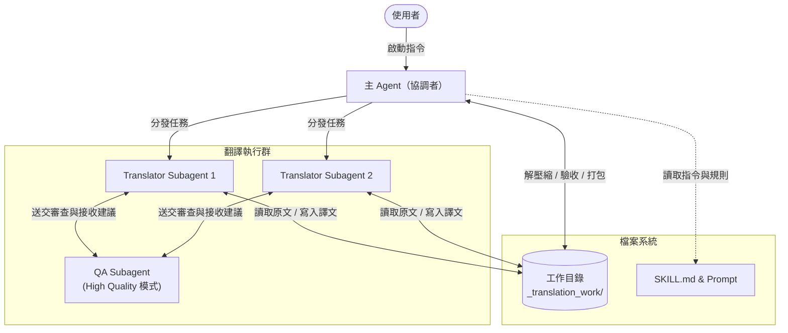
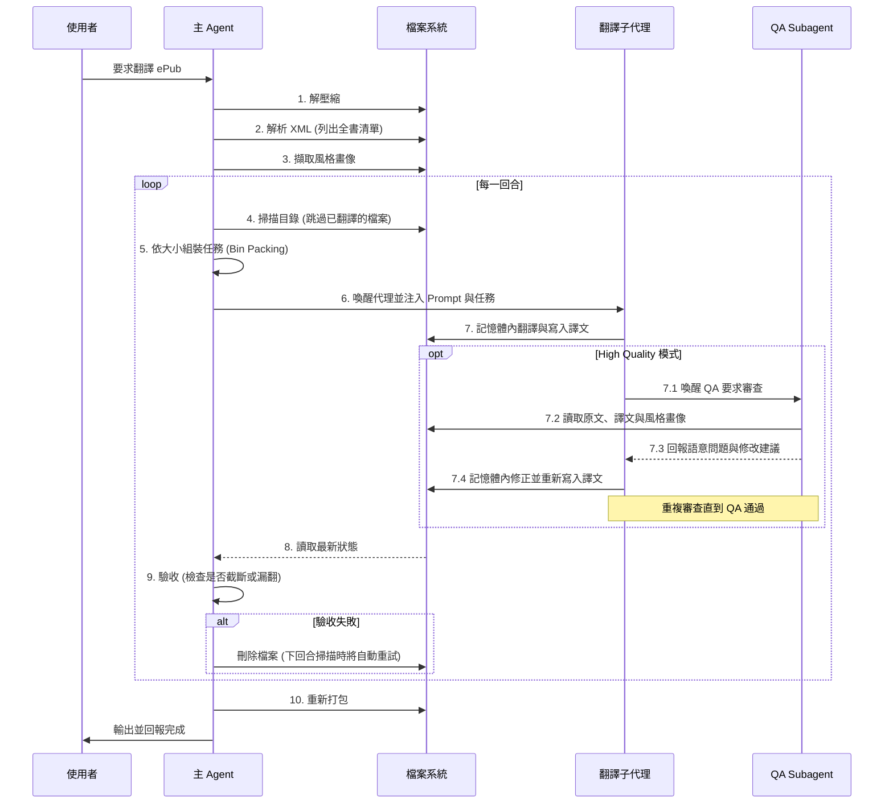

# Awesome ePub Translator: 技術實作解析

這份文件深入解析 `awesome-epub-translator` 技能在 Antigravity 框架下的技術實作細節。這個技能展示了如何利用大語言模型 (LLM) 結合多代理 (Multi-Agent) 架構，完成複雜的檔案處理與長文本翻譯任務。

## 1. 系統架構與設計哲學

此技能的核心設計哲學是 **「以自然語言定義程式邏輯」與「語意解析優先」**。整個翻譯的 Workflow 是寫在 `SKILL.md` 中的 Markdown 指令。主 Agent 扮演 Orchestrator（協調者）的角色，負責檔案系統操作、解析 XML 結構、策略分配，並調度 Subagents（子代理）來處理耗時的翻譯工作。

### 為什麼選擇 Agentic 解析（而非傳統程式解析）？

在開發文件翻譯工具時，業界最傳統的作法是「程式解析 (Programmatic Parsing) + API 呼叫」——亦即利用 BeautifulSoup 等腳本把純文字節點抽出，送交翻譯後再塞回原節點。然而，本專案刻意捨棄此作法，改讓 Agent 直接處理帶有 HTML 標籤的原始碼，主要原因在於解決**「語意斷層」與「行內標籤 (Inline Tags)」**的痛點：

* **從「語法解析」走向「語意解析」**：傳統程式只能依據 HTML 標籤（如 `
`, ``, ` `）生硬地切斷句子。由於電子書製作者經常為了視覺排版（如首字放大、句中變色、強制換行）在句中插入標籤，這會導致完整的語意被切碎。透過 Agentic 解析，我們將「斷句與分塊」的責任交給 LLM。Agent 一次讀取大段 HTML，能跨越視覺標籤的干擾，還原並翻譯完整的語意。
* **行內標籤的語序重組**：不同語言的文法語序不同。例如 `
This is a <em>very important</em> concept in <strong>Python</strong>.
` 翻譯成中文時，由於語序改變，標籤的位置必須對應移動。傳統程式無法判斷 `<em>` 該套在中文的哪個詞彙上。而 Agent 能在翻譯時，自然地將 HTML 標籤精準地重組並包覆在目標語言正確的詞彙上，保留最完美的排版。

### 系統架構圖 (Architecture)
此架構展示了主代理、子代理與檔案系統之間的拓樸關係與職責劃分。

### 執行流程圖 (Sequence)
此流程展示了從解壓縮、分批翻譯、驗收防呆到最終打包的時序互動。

## 2. 核心工作流程 (Workflow)

翻譯過程分為幾個主要階段，嚴格按照 `SKILL.md` 中的定義執行：

### A. 前置處理與解析
1. **解壓縮**：使用系統內建的 `unzip` 將 `.epub` 解壓縮至暫存目錄 `_translation_work/`。
2. **尋找內容清單**：
   - 讀取 `META-INF/container.xml` 找到 `content.opf` 的路徑。
   - 讀取 `content.opf` 解析出檔案清單 (Manifest) 與閱讀順序 (Spine)，找出所有需要翻譯的 XHTML 檔案與目錄 (TOC) 檔案。
3. **建立風格畫像 (Style Profile)**：
   - 為了確保多個 Subagent 翻譯出來的語氣一致，系統會先讀取第一章的前幾個段落。
   - 分析詞彙難度、語氣、視角等，產生一份 `style_profile.md`。這份畫像會被注入到所有子代理的 Prompt 中。

### B. 智能分發與平行翻譯
這是此技能效能的關鍵。為了突破單一 Agent 的 Context Limit 並加速處理：
1. **Size-aware Bin Packing (依檔案大小分配)**：
   - 主 Agent 會利用貪婪演算法，動態計算並將檔案公平地分發給最多 3 個 Subagents。
   - 關於此分配演算法（容量限制、排序與貪婪分發機制）的詳細實作，請參閱獨立文件：[BIN_PACKING_STRATEGY.md](BIN_PACKING_STRATEGY.md)
2. **Invoke Subagent**：
   - 主 Agent 透過 `invoke_subagent` 工具同時啟動這些子代理。
   - 傳遞給子代理的 Prompt 包含了：`style_profile.md` (風格)、`translation-prompt.md` (翻譯規則)、以及分配到的檔案清單。

### C. 子代理的翻譯策略 (In-memory Translation)
Subagent 在翻譯具體檔案時，遵循一個嚴格的**記憶體內處理 (In-memory) 策略**：
1. **禁用 Replace 工具**：明確禁止使用 `replace_file_content`（尋找與取代），因為在大型 HTML 檔案中找獨特字串很容易失敗且消耗大量 Context。
2. **Batch Processing**：
   - 使用 `view_file` 讀取整個 XHTML。
   - 在記憶體中將 HTML 元素（如 `
`, `<h1>`）依據語意邊界分批（每批約 2000-3000 字元）。
   - 保留上一批的最後幾個段落作為 Context（不重新翻譯），以維持上下文連貫性。
3. **保留標籤 (Inline Tag Preservation)**：
   - 透過 `translation-prompt.md` 的 Few-shot 範例，指示 LLM 在翻譯文字時，必須將原本的 HTML tag（如 `<em>`, `<strong>`）移動到目標語言中對應的字詞上。
4. **一次性寫入**：翻譯完成後，重組完整的 HTML 結構，使用 `write_to_file` 一次性將整個檔案寫入 `_translated/` 目錄。

### D. 高質量 QA 模式 (Maker-Checker Architecture)
為了追求極致的翻譯品質，系統提供了 `--high-quality` 參數來啟用 Maker-Checker 架構：
1. **動態賦權**：當開啟此模式時，主 Agent 會透過 `define_subagent` 賦予翻譯子代理 (Translator) 呼叫其他子代理的權限。
2. **深度語意審查 (Deep Semantic Review)**：Translator 在寫入譯文後，會喚醒一個專屬的 `QA Subagent (epub-qa-reviewer)`。QA 會對照 `style_profile.md` 與原文，進行語氣、漏翻、雙關語等深度審查，而非僅僅是結構防呆。
3. **自我修正迴圈 (Self-Correction Loop)**：建立 `Translator -> QA Reviewer` 的內部工作流。如果 QA 發現問題，會直接提供修改建議，Translator 會在記憶體中修正並重新寫入，直到 QA 審查通過才會向主 Agent 回報進度。這使得主 Agent 的 Context 不會被大量的驗收細節污染，貫徹了職責分離 (Separation of Concerns)。

### E. 後置處理與打包
1. **翻譯目錄與 Metadata**：主 Agent 接手翻譯 `toc.ncx` / `toc.xhtml`，並更新 `content.opf` 中的 `<dc:language>` 與標題。
2. **乾淨的 Staging 環境**：建立 `_staging` 目錄，只複製原始 ePub 結構與翻譯後的檔案，過濾掉工作目錄中的 `.md`, `.log` 等暫存檔。
3. **雙語模式注入 (Bilingual Mode)**：如果開啟雙語模式，子代理會保留原文並加上帶有 `.translated` class 的譯文。主 Agent 則負責在打包前動態注入對應的 CSS 樣式。
4. **重新打包**：使用系統的 `zip` 指令（或自動 Fallback 到內建的 Python zipfile 腳本）將檔案重新打包為規範的 `.epub` 格式。

## 3. 關鍵技術亮點

* **自動斷點續傳 (Checkpoint-based Resumability)**：
  透過將翻譯好的檔案獨立存放在 `_translated/` 目錄，如果任務因故中斷（如網路問題、使用者暫停），下次啟動時主 Agent 會檢查該目錄，直接跳過已存在的檔案。
* **Zero External Dependencies**：
  技能設計上不依賴任何外部的 Python 庫（如 BeautifulSoup 或 ePub 解析庫），純粹依靠 Antigravity 內建的檔案讀寫工具 (`view_file`, `write_to_file`) 與系統基礎指令 (`unzip`, `zip`, `python`)。這確保了技能在任何標準環境下的高相容性。
* **Prompt Engineering**：
  將通用的邏輯寫在 `SKILL.md`，而將高度專業的翻譯提示抽離到 `references/translation-prompt.md`。透過 `{STYLE_PROFILE}` 等佔位符，在執行期動態組裝 Prompt。

## 4. 錯誤處理與限制迴避

* **DRM 偵測**：在早期階段檢查 `META-INF/encryption.xml`，避免在無法解密的檔案上浪費 Token。
* **避免超長元素中斷**：遇到超過 3000 字元的單一 HTML 節點時，策略指示子代理將其獨立為一個 Batch 處理。
* **防護機制**：子代理完成任務後，主 Agent 會檢查翻譯檔案的完整性（例如是否缺少 closing tag 或檔案過小）。如果發現異常，會刪除該檔案並在下一回合重試。
